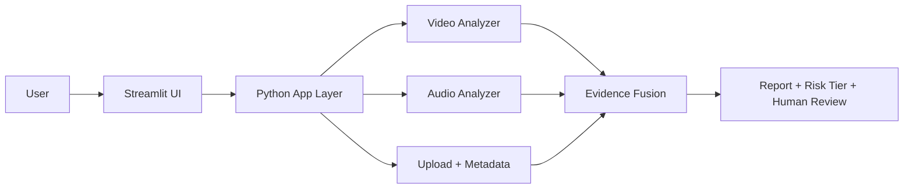

# Explainable Multimodal Deepfake Forensics & Provenance Prototype

## Slide 1 — Title
Title: Explainable Multimodal Deepfake Forensics & Provenance Prototype

Subtitle:
"From black-box confidence scores to transparent forensic evidence"

Speaker notes:
"Good morning everyone. Today we’re presenting a local prototype for an explainable deepfake forensics system. The core issue is that many current tools output only a binary or confidence-based result, which is not actionable. We built a prototype that explains what looks manipulated, when it happened, and whether it should go to human review."

---

## Slide 2 — Problem
Problem statement:
- Deepfakes are often hybrid manipulations, not fully synthetic media.
- Real footage can be paired with AI face swaps or altered audio.
- Most current tools give only a single score like “87% fake,” which is not useful for real decision-making.
- Journalists, moderators, and users need evidence, not black-box predictions.

Speaker notes:
"The main problem is that authenticity tools today are often black-box systems. They tell you a score, but not where or how the media was altered. In the real world, deepfakes are not typically fully synthetic; they are often partial edits. This is why a score alone is not sufficient for trust and safety, journalism, or everyday verification."

---

## Slide 3 — Solution
Our solution:
- upload a local video or audio file
- analyze the visual and audio streams separately
- detect suspicious time windows and likely manipulated regions
- generate a plain-language forensic summary
- recommend human review instead of automatic deletion

Speaker notes:
"Our prototype changes the product model from a verdict engine to a forensic assistant. It highlights suspicious time windows, provides a narrative explanation, and recommends human review instead of making a definitive authenticity claim. This is safer and more useful for real-world decisions."

---

## Slide 4 — Why This Matters
Why it matters:
- misinformation risk is growing
- moderation teams need evidence before action
- journalists need exact manipulated segments and timelines
- everyday users need understandable explanations
- uncertainty must be preserved instead of hidden

Speaker notes:
"This matters because trust decisions are high-stakes. A wrong takedown or a missed deepfake can have real reputational and legal consequences. We designed our tool to support review, not replace judgment. The focus is on evidence and explanation, not overclaiming certainty."

---

## Slide 5 — MVP Architecture

Speaker notes:
"The architecture is intentionally simple and local. A user uploads media to a lightweight Streamlit interface. The app extracts metadata, processes the video and audio streams, and combines the results into a final evidence summary. The output isn’t a decisive real/fake label; it is a report with risk and recommended action."

---

## Slide 6 — Pipeline Flow
Pipeline flow:
1. Upload media
2. Extract metadata and provenance signals
3. Decompose the media into frame and audio streams
4. Run anomaly checks
5. Fuse evidence and generate the report
6. Recommend human review

Speaker notes:
"The processing pipeline is deliberately straightforward. We validate the file type, inspect metadata, estimate suspicious regions and time windows, and combine the findings into a final risk summary. This simple flow makes the prototype easy to run locally and easy to explain during the demo."

---

## Slide 7 — Key Technical Details
Technical highlights:
- Python + Streamlit for local app UI
- OpenCV for frame-level analysis
- Librosa for audio signal feature analysis
- Metadata extraction for provenance and file context
- Synthetic validation data for clean vs suspicious cases

Speaker notes:
"This project is intentionally built to run locally in a hackathon setting. We used Python, Streamlit, OpenCV, and Librosa because they allow us to build a working prototype quickly while still modeling real forensic workflows. We also generate synthetic test clips so we can validate clean and suspicious scenarios with clear pass/fail checks."

---

## Slide 8 — Validation Strategy
Validation approach:
- clean sample should remain low-risk
- suspicious sample should trigger anomaly warnings
- output should be explainable and cautious
- no definitive verdict is emitted

Speaker notes:
"We validate the prototype on both positive and negative cases. A clean sample should not trigger strong warnings, while a suspicious sample should. This is important because a forensic system must be calibrated and honest about uncertainty. We are not claiming a perfect detector—we are demonstrating a working evidence-based prototype."

---

## Slide 9 — Example Output
Example output:
- “Face inconsistencies detected in frames 140–190.”
- “Audio discontinuity detected between 0:18–0:24.”
- “No clear provenance chain found.”
- “Risk tier: Medium. Recommended action: Human review.”

Speaker notes:
"This is the kind of result we want users to see. It is easy to understand, easy to act on, and it does not pretend to know the objective truth with certainty. The system gives evidence and a recommended next step, which is exactly what the real use case demands."

---

## Slide 10 — Limitations and Future Work
Current prototype limitations:
- heuristic-based instead of production-grade deepfake models
- local prototype only
- synthetic validation dataset
- no live moderation workflow yet

Future work:
- stronger face and speech models
- provenance verification integration
- confidence calibration and review queue
- deployment in a staging environment

Speaker notes:
"We are very deliberate about the scope. This is a hackathon prototype, not a production system. We kept the design simple and explainable, but the path forward is clear: stronger model stacks, provenance integration, and moderation workflow support. The concept is sound, and the architecture is built to scale."

---

## Slide 11 — Closing
Closing statement:
"We built a local, explainable deepfake forensics prototype that turns uncertainty into evidence, and evidence into action. Instead of a black-box score, we deliver a forensic summary for human review. That is the safer and more useful product for a world of increasingly manipulated media."

Speaker notes:
"To close, our work demonstrates that trust-aware media forensic tooling can be made understandable, practical, and review-friendly. In a world where manipulated media is becoming normal, transparency is not optional. We are not building a definitive verdict engine—we are building a tool that helps people investigate responsibly."

---

## 3-Minute Pitch Script

"Today, we’re presenting an explainable multimodal deepfake forensics prototype.

The problem is that most deepfake detection systems still behave like black boxes: they output a score, but they don’t tell you where the manipulation happened, what modality was affected, or what evidence supports the conclusion. That is not useful for journalists, moderators, or everyday users.

Our solution is a local prototype that uploads media, analyzes both the video and audio streams, identifies suspicious time windows, and produces a plain-language forensic summary. It explains what looks manipulated, when it happened, and whether the content should be routed to human review rather than being treated as a definitive real or fake verdict.

The architecture is intentionally simple and local. A user uploads media to a lightweight app, the system extracts metadata and signal features, the video and audio branches analyze suspicious patterns, and the system fuses those results into a final evidence-based report.

This matters because trust decisions are high-stakes. A wrong takedown or missed deepfake can have serious consequences. Our system is designed around uncertainty, explainability, and human review instead of overconfident automation.

We validated the prototype against clean and suspicious synthetic media samples. The clean sample stayed low-risk, while the suspicious sample triggered detection and produced a summary recommending human review. That confirms the prototype works as an evidence-based, explainable demo for a hackathon environment.

This is not a production-grade detector yet, but it is a strong, credible proof of concept. The path forward is clear: stronger model stacks, provenance verification, and a full review workflow. Our core contribution is a safer product pattern: explainability first, confidence calibration second, and human judgment always in the loop.

Thank you."
