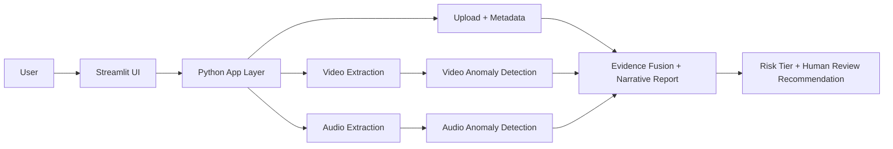
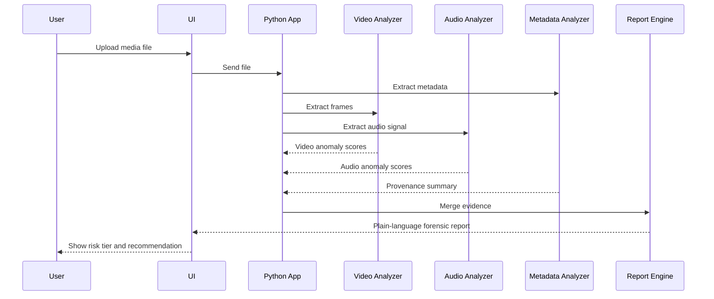

# Hackathon Submission Deck

## Title
Explainable Multimodal Deepfake Forensics & Provenance Prototype

---

## Slide 1: Problem
Deepfakes are no longer only fully synthetic. They are often hybrid manipulations: real footage with AI-modified faces, cloned audio, or localized edits.

The core problem is not just detection — it is explainability.

Users need to know:
- what was tampered with
- when it happened
- why the system thinks it is suspicious
- whether it should be escalated to human review

---

## Slide 2: Our Solution
We built a local prototype that:
- uploads a video or audio file
- extracts metadata and media signals
- analyzes suspicious visual and audio segments
- generates a plain-language forensic summary
- recommends human review rather than a definitive real/fake verdict

This is a human-in-the-loop design, not an automated takedown engine.

---

## Slide 3: Key Features
- Local media upload
- Video anomaly detection based on frame-to-frame inconsistency
- Audio anomaly detection based on discontinuity and energy variations
- Provenance summary with missing metadata warnings
- Plain-language forensic explanation
- Risk tier and human review recommendation

---

## Slide 4: Architecture Overview



---

## Slide 5: Code Structure

```text
DeepFakes_Hackathon/
├── app.py                  # Local demo UI and analysis logic
├── requirements.txt        # Python dependency list
├── scripts/
│   ├── generate_test_media.py
│   ├── evaluate_test_cases.py
│   └── run_hackathon_validation.py
├── test_data/
│   ├── clean_clip.mp4
│   ├── suspicious_clip.mp4
│   ├── clean_audio.wav
│   └── suspicious_audio.wav
├── docs/
│   ├── PRD.md
│   ├── technical-spec.md
│   ├── backlog.md
│   ├── spec-driven-development-guide.md
│   ├── hackathon-task-board.md
│   ├── mvp-architecture.md
│   ├── local-prototype-stack.md
│   ├── test-data.md
│   └── hackathon-submission-deck.md
```

---

## Slide 6: Sequence Diagram



---

## Slide 7: Why This Matters
This approach shifts the conversation from a shallow “real/fake” label to a transparent forensic explanation:

- what looks manipulated
- where it likely happened
- how confident the system is
- what the recommended next action is

That matters for trust, moderation, journalism, and safer media review.

---

## Slide 8: Demo Flow
1. Upload a sample media file
2. System extracts metadata and signal features
3. Video and audio suspicious segments are estimated
4. Findings are summarized in plain language
5. App recommends human review

---

## Slide 9: Demo Validation
We validate against clean and suspicious synthetic samples.

Test criteria:
- clean media should stay below anomaly threshold
- suspicious media should trigger anomaly warnings
- the report should remain readable and cautious

This shows the system is functioning for the MVP, even without a full production deepfake stack.

---

## Slide 10: Limitations and Future Direction
This hackathon prototype is intentionally simple.

Current limitations:
- heuristic-based rather than production-grade model pipeline
- local prototype only
- synthetic validation data
- no production deployment or moderation system

Future work:
- stronger face and audio detection models
- provenance verification integrations
- better confidence calibration
- review queue workflow and team dashboard

---

## Slide 11: Closing Message
We built a prototype not for definitive verdicts, but for trust-aware forensic reasoning.

The key value is transparency, explainability, and responsible escalation to human review.

This is a meaningful step toward safer media verification in the deepfake era.
