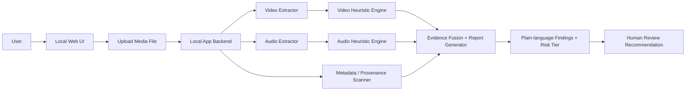

# Minimal MVP Architecture Diagram

## How to read this
- The app runs locally and accepts a media upload.
- Video and audio are processed separately.
- Each branch produces time-based suspicious signals.
- Metadata and provenance are checked separately.
- The final output is a human-readable report and a recommendation for human review.

## Minimal implementation choices
- Frontend: Streamlit
- Backend: Python app layer
- Video: OpenCV
- Audio: librosa / scipy
- Metadata: ffprobe / file metadata parsing
- Storage: temporary local files only

## Why this is sufficient for the hackathon
This design gives a complete demo loop without introducing cloud infrastructure, complex deployments, or production systems. It stays aligned with the project goal: explainable, evidence-based forensic analysis with uncertainty and human review.
